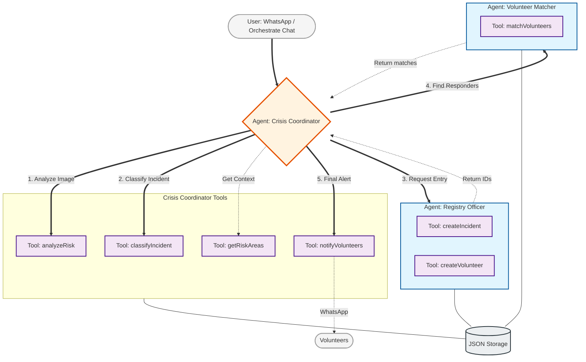

# Complete Orchestrated Application Flow

This diagram presents all tools and agents, centered around the **Crisis Coordinator** as the primary orchestrator of the disaster response system.

## Agent & Tool Catalog

| Agent | Tools Managed | Responsibility |
| :--- | :--- | :--- |
| **Crisis Coordinator** | `analyzeRisk`, `classifyIncident`, `getRiskAreas`, `notifyVolunteers` | Orchestrates the triage, context gathering, and final execution of notifications. |
| **Registry Officer** | `createIncident`, `createVolunteer` | Handles formal data persistence and ID generation. |
| **Volunteer Matcher** | `matchVolunteers` | Computational matching of incidents to available human resources. |
