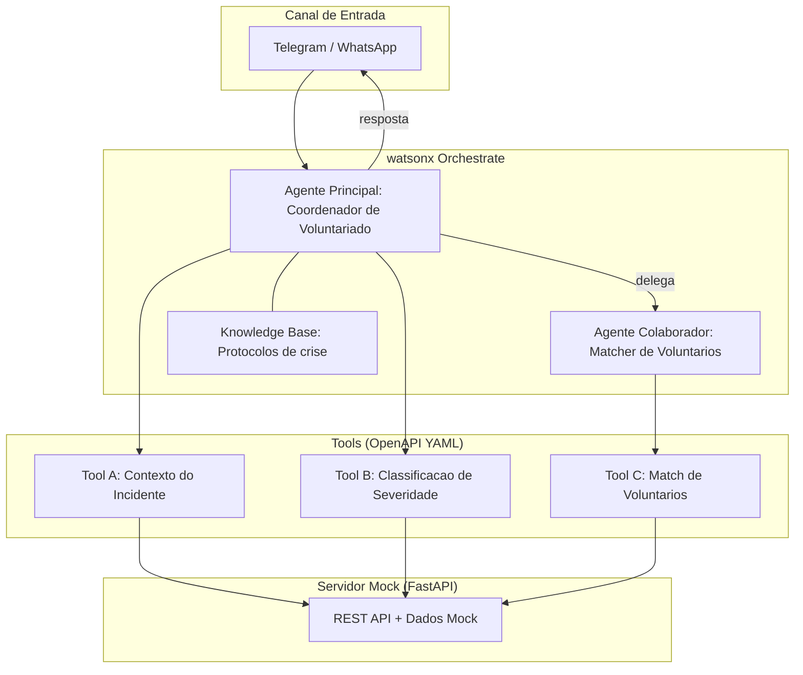
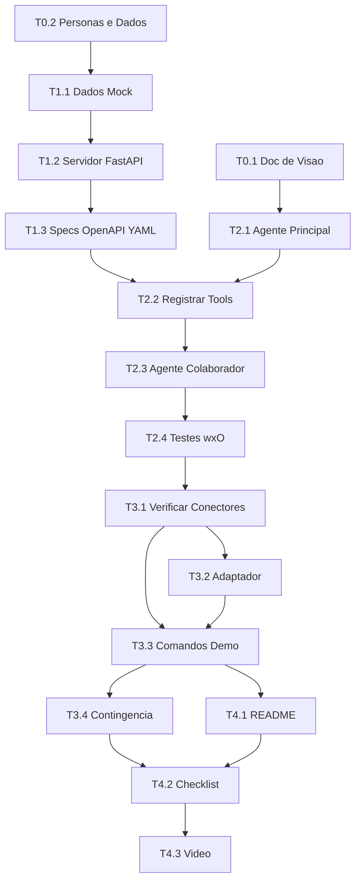

# Hackathon UNASP 2026 - Plano de Implementacao

> **Tema:** Orquestrando o Voluntariado Inteligente para Situacoes de Crise
> **Prazo:** 27/04/2026 ate 19h
> **Entregaveis:** PoC no GitHub + Video demo (max 3 min)

---

## Visão Geral

O projeto constroi uma **plataforma inteligente de coordenacao de voluntariado para situacoes de crise**, usando o cenario de **deslizamentos de terra** como caso de uso. O **IBM watsonx Orchestrate (wxO)** e o nucleo de orquestracao, coordenando agentes de IA que:

1. Recebem descricoes de incidentes de instituicoes (ex.: defesa civil)
2. Classificam a severidade do incidente (Critico, Moderado, Baixo)
3. Fazem o **match inteligente** entre habilidades dos voluntários e necessidades do incidente
4. Notificam os voluntarios selecionados via canal de mensageria

> [!IMPORTANT]
> **Enquadramento validado** (fonte: `docs/Tematica do Hackathon 2026.pdf`):
>
> O tema exige uma solucao que:
> 1. "Mapear habilidades, disponibilidade e contexto dos voluntarios" -- **Atendido:** banco de voluntarios com skills + localizacao + disponibilidade
> 2. "Permitir que instituicoes descrevam necessidades reais e urgentes" -- **Atendido:** instituicao descreve incidente via chat, agente classifica severidade
> 3. "Utilizar IA para recomendar as melhores formas de contribuicao de cada pessoa" -- **Atendido:** matching inteligente por habilidade (60%) + proximidade (40%)
> 4. "Orquestrar fluxos de acoes, comunicacao e acompanhamento por meio do IBM watsonx Orchestrate" -- **Atendido:** wxO como nucleo, agente principal + agente colaborador + tools
>
> Na demo e docs, usar a linguagem do tema: "conectar voluntarios e instituicoes", "skill-based volunteering", "orquestracao inteligente", "impacto social".

### Arquitetura do Sistema



### Fluxo Macro por Marcos

```mermaid
flowchart LR
    subgraph M0["Marco 0: Enquadramento"]
        T01[Visao e Alinhamento]
        T02[Personas e Roteiros]
    end
    subgraph M1["Marco 1: Dados e Servidor"]
        T11[Dados Mock]
        T12[Servidor FastAPI]
        T13[Specs OpenAPI YAML]
    end
    subgraph M2["Marco 2: Nucleo wxO"]
        T21[Agente Principal + Knowledge]
        T22[Registrar Tools]
        T23[Agente Colaborador]
        T24[Testes de Conversa]
    end
    subgraph M3["Marco 3: Mensageria"]
        T31[Verificar Conectores wxO]
        T32[Servico Adaptador]
        T33[Comandos e Fluxos Demo]
    end
    subgraph M4["Marco 4: Entrega"]
        T41[README e Docs Finais]
        T42[Checklist e Ensaio]
        T43[Gravacao do Video]
    end
    M0 --> M1
    M1 --> M2
    M2 --> M3
    M3 --> M4
```



---

## Marco 0 -- Enquadramento do Projeto (Estimativa: 1-2h)

> [!IMPORTANT]
> Este marco e **bloqueante** -- validado contra os documentos oficiais:
>
> **Do edital:** "projetar e desenvolver uma solucao de IA agentic (baseada em agentes) em formato de prova de conceito, utilizando o IBM watsonx Orchestrate" -- sem wxO como nucleo, o projeto esta fora do edital.
>
> **Da tematica:** "existe uma desconexao significativa entre pessoas que desejam ajudar e instituicoes que precisam de apoio organizado" -- o enquadramento precisa mostrar que o projeto resolve essa desconexao, nao que e uma ferramenta tecnica de defesa civil.
>
> **Os 4 desafios que a tematica lista e que o projeto deve resolver:**
> 1. "Voluntarios frequentemente nao sabem como suas habilidades podem ser melhor utilizadas"
> 2. "Instituicoes tem dificuldade em mapear, filtrar e coordenar voluntarios de forma eficiente"
> 3. "Em cenarios de emergencia, ha falta de priorizacao, redundancia de esforcos e comunicacao fragmentada"
> 4. "Pouca utilizacao de dados e IA para tomada de decisao rapida e escalavel"
>
> O documento de visao (T0.1) deve conectar cada funcionalidade do sistema a esses 4 pontos.

---

### T0.1 -- Documento de Visao e Alinhamento ao Tema

**Descricao:** Criar `docs/visao.md` explicando como o projeto se encaixa no tema oficial "Orquestrando o Voluntariado Inteligente para Situacoes de Crise". O documento deve conectar os 4 desafios listados na tematica com as funcionalidades do sistema.

**Sugestoes de implementacao:**
- Estruturar o documento respondendo aos 4 problemas da tematica oficial:
  1. "Voluntarios nao sabem como suas habilidades podem ser utilizadas" -> matching inteligente por skills
  2. "Instituicoes tem dificuldade em mapear e coordenar voluntarios" -> orquestracao via wxO
  3. "Falta de priorizacao e comunicacao fragmentada em emergencias" -> classificacao de severidade + notificacao automatizada
  4. "Pouca utilizacao de IA para decisao rapida" -> agentes de IA com tools especializadas
- Usar a terminologia exata do tema: "skill-based volunteering", "orquestracao inteligente", "impacto social"
- Referenciar `docs/Tematica do Hackathon 2026.pdf` como fonte

---

### T0.2 -- Personas, Dados e Roteiros da Demo

**Descricao:** Definir personas ficticias (instituicao + voluntarios), cenarios de incidentes e roteiros de conversa para a demo. Esses dados servem de base para todo o restante do projeto.

**Sugestoes de implementacao:**
- Criar `dados/personas.json`:
  ```json
  {
    "institution": {
      "name": "Defesa Civil Municipal - Sao Paulo",
      "contact": "coordenador@demo.gov.br"
    },
    "volunteers": [
      {
        "id": "v1",
        "name": "Ana Silva",
        "skills": ["first_aid", "logistics"],
        "location": {"lat": -23.55, "lng": -46.63},
        "available": true
      },
      {
        "id": "v2",
        "name": "Carlos Mendes",
        "skills": ["structural_engineering", "search_and_rescue"],
        "location": {"lat": -23.52, "lng": -46.61},
        "available": true
      }
    ]
  }
  ```
- Definir 6-8 voluntarios com habilidades variadas
- Criar `dados/incidentes_demo.json` com 2-3 cenarios pre-definidos
- Escrever `docs/demo-scripts.md` com 2 roteiros: caminho feliz + caso com informacao incompleta
- Skills a usar: `first_aid`, `logistics`, `drone_operator`, `gis_mapping`, `psychological_support`, `structural_engineering`, `search_and_rescue`, `communication`

---

## Marco 1 -- Dados Mock e Servidor API (Estimativa: 3-4h)

> [!TIP]
> Este marco vem **antes** do Marco 2 porque o wxO precisa de endpoints funcionais para registrar as tools. As specs OpenAPI YAML sao o contrato entre o servidor e o wxO.

---

### T1.1 -- Criar Arquivos de Dados Mock

**Descricao:** Criar datasets ficticios versionados no repositorio para alimentar o servidor mock.

**Sugestoes de implementacao:**
- Estrutura de `dados/`:
  ```
  dados/
    voluntarios.json          # pool de voluntarios com skills e localizacao
    incidentes_demo.json      # cenarios de incidentes pre-definidos
    areas_risco.json          # areas de encosta com scores de risco
    personas.json             # instituicao + voluntarios para demo
    imagens_demo/
      cenario_01.jpg
      cenario_02.jpg
      README.md               # declaracao de que imagens sao ficticias
      metadata.json            # mapeamento imagem -> descricao
  ```
- Usar coordenadas realistas de Sao Paulo mas marcadas como ficticias
- Cada cenario de incidente deve ter: descricao, localizacao, skills necessarias, severidade esperada

---

### T1.2 -- Servidor HTTP Mock (FastAPI)

**Descricao:** Implementar o servidor que expoe os dados mock como APIs REST. Este servidor e o backend que as tools do wxO vao chamar.

**Sugestoes de implementacao:**
- Estrutura do projeto:
  ```
  server/
    main.py                   # FastAPI app, routes, startup
    models.py                 # Pydantic request/response models
    services/
      classifier.py           # incident severity classification
      matcher.py              # volunteer matching logic (skill + proximity)
      geo_context.py          # geospatial/risk area data
    data/                     # copy or symlink to dados/
    requirements.txt          # fastapi, uvicorn, pydantic
  ```
- Endpoints:
  ```
  GET  /api/v1/health
  POST /api/v1/incidents/classify
  POST /api/v1/geo-context
  POST /api/v1/volunteers/match
  GET  /api/v1/volunteers
  ```
- Logica de matching:
  ```python
  def match_volunteers(incident, volunteers):
      required_skills = incident["required_skills"]
      scores = []
      for v in volunteers:
          skill_overlap = len(set(v["skills"]) & set(required_skills))
          skill_score = skill_overlap / len(required_skills)
          distance = haversine(incident["location"], v["location"])
          prox_score = max(0, 1 - distance / 50)
          total = skill_score * 0.6 + prox_score * 0.4
          scores.append({"volunteer": v, "score": total})
      return sorted(scores, key=lambda x: x["score"], reverse=True)
  ```
- Servidor precisa estar acessivel externamente (ngrok para dev, ou deploy gratuito como Railway/Render)

---

### T1.3 -- Specs OpenAPI YAML para as Tools

**Descricao:** Criar os arquivos YAML de especificacao OpenAPI que serao importados no wxO para registrar as tools. Cada spec deve corresponder exatamente aos endpoints do servidor.

> [!IMPORTANT]
> O guia da IBM confirma que tools sao **importadas via arquivo YAML OpenAPI**. Esses arquivos sao obrigatorios e devem ser criados antes de configurar os agentes no wxO.

**Sugestoes de implementacao:**
- Criar `wxo/tools/` com as specs:
  ```
  wxo/
    tools/
      incident_classifier.yaml    # Tool B: classificacao de severidade
      volunteer_matcher.yaml      # Tool C: match de voluntarios
      geo_context.yaml            # Tool A: contexto de areas de risco
  ```
- Exemplo de spec completa:
  ```yaml
  openapi: 3.0.0
  info:
    title: Incident Classifier
    version: 1.0.0
    description: Classifies incident severity based on description
  servers:
    - url: https://your-server-url.ngrok.io
  paths:
    /api/v1/incidents/classify:
      post:
        operationId: classifyIncident
        summary: Classify the severity of a crisis incident
        description: >
          Receives a text description of an incident and returns
          severity classification (critical, moderate, low) with reasoning.
        requestBody:
          required: true
          content:
            application/json:
              schema:
                type: object
                required:
                  - description
                properties:
                  description:
                    type: string
                    description: Text description of the incident
                  location:
                    type: string
                    description: Location of the incident
        responses:
          '200':
            description: Classification result
            content:
              application/json:
                schema:
                  type: object
                  properties:
                    severity:
                      type: string
                      enum: [critical, moderate, low]
                    confidence:
                      type: number
                    reasoning:
                      type: string
                    required_skills:
                      type: array
                      items:
                        type: string
  ```
- A URL do servidor nos YAMLs deve ser atualizada quando o ngrok/deploy estiver pronto
- FastAPI gera specs OpenAPI automaticamente em `/docs` -- pode usar como referencia

---

## Marco 2 -- Nucleo watsonx Orchestrate (Estimativa: 4-6h)

> [!IMPORTANT]
> Este e o componente **obrigatorio**. A solucao **precisa** usar o wxO como orquestrador central. O padrao a seguir e o mesmo do exercicio do guia IBM: agente principal + agente colaborador + tools importadas via YAML + knowledge base.

---

### T2.1 -- Criar Agente Principal + Knowledge Base

**Descricao:** Configurar o agente principal "Coordenador de Voluntariado em Crise" no wxO. Esse agente recebe descricoes de incidentes, classifica a severidade e orquestra o fluxo. Tambem deve ter uma knowledge base com documentos sobre protocolos de resposta.

**Sugestoes de implementacao:**
- No wxO, criar agente com:
  - **Nome:** CrisisCoordinator (ou "Coordenador de Voluntariado")
  - **Descricao:** "Agent that coordinates volunteer response to crisis events. Receives incident descriptions, classifies severity, identifies required skills, and delegates volunteer matching to a collaborator agent."
  - **Instrucoes do agente:**
    - Papel: coordenador de resposta voluntaria a crises, especializado em deslizamentos
    - Tom: acolhedor, objetivo, urgente mas calmo
    - Fluxo: receber descricao -> classificar -> identificar skills -> delegar matching -> apresentar resultado
    - Restricoes: nao fazer afirmacoes absolutas, apresentar dados como demonstracao
    - Formato: texto estruturado, tabelas em monoespacado para caber em mensageiros
- **Knowledge Base:** fazer upload de documento(s) cobrindo:
  - Protocolos de resposta a desastres de deslizamento
  - Lista de habilidades relevantes e suas descricoes
  - Criterios de severidade (quando e critico vs. moderado vs. baixo)
  - Criar `docs/knowledge_crisis_protocols.md` para esse fim
  - Na descricao do Knowledge, adicionar: "This document covers crisis response protocols for landslide events, volunteer skill categories, and severity classification criteria."
- Usar modelos **Granite** para minimizar consumo de creditos

---

### T2.2 -- Importar e Registrar Tools no wxO

**Descricao:** Importar os arquivos YAML criados em T1.3 para registrar as tools no agente principal. Seguir o fluxo do guia IBM (Toolset -> Import -> selecionar YAML -> selecionar tools -> Done).

**Sugestoes de implementacao:**
- No wxO, acessar o agente CrisisCoordinator
- Ir na aba **Toolset** -> **Import**
- Importar cada arquivo YAML:
  - `incident_classifier.yaml` -> Tool de classificacao de severidade
  - `geo_context.yaml` -> Tool de contexto de areas de risco
- **Nao** importar `volunteer_matcher.yaml` aqui -- essa tool vai no agente colaborador
- Testar cada tool individualmente no chat do wxO
- Verificar no "Show reasoning" se o agente esta chamando as tools corretamente

---

### T2.3 -- Criar Agente Colaborador (Matcher de Voluntarios)

**Descricao:** Criar um segundo agente "VolunteerMatcher" que e especializado em encontrar voluntarios adequados. Esse agente e adicionado como **colaborador** do agente principal, seguindo o padrao AskBenefits -> AskDental do guia IBM.

**Sugestoes de implementacao:**
- No wxO, criar novo agente:
  - **Nome:** VolunteerMatcher
  - **Descricao:** "Specialized agent that matches volunteers to crisis incidents based on skills and geographic proximity. Returns a ranked list of recommended volunteers."
  - **Instrucoes:** receber detalhes do incidente (severidade, skills necessarias, localizacao), chamar a tool de matching, formatar resultado como lista ranqueada
- Importar `volunteer_matcher.yaml` na aba Toolset deste agente
- **Deploy** do VolunteerMatcher
- Voltar ao agente CrisisCoordinator:
  - Aba **Toolset** -> **Add agent** -> **Add from local instance**
  - Selecionar **VolunteerMatcher**
  - **Deploy** novamente
- Testar no chat: quando o usuario pedir voluntarios, o CrisisCoordinator deve delegar para o VolunteerMatcher

---

### T2.4 -- Testes de Fluxo Completo no wxO

**Descricao:** Testar o workflow completo dos agentes no chat do wxO usando os roteiros da demo. Verificar reasoning, chamadas de tools e qualidade das respostas.

**Sugestoes de implementacao:**
- Cenarios de teste usando os roteiros de `docs/demo-scripts.md`:
  1. Descrever um deslizamento -> agente classifica como Critico
  2. Pedir lista de voluntarios -> agente delega para VolunteerMatcher -> retorna ranking
  3. Pedir detalhes sobre area de risco -> agente chama tool de geo context
  4. Perguntar sobre protocolos -> agente responde usando knowledge base
  5. Informacao incompleta -> agente faz perguntas de esclarecimento
- Para cada teste, clicar em **"Show reasoning"** e verificar:
  - Qual tool foi chamada e com quais parametros
  - Se a delegacao para o colaborador funcionou
  - Se a knowledge base foi consultada quando relevante
- Documentar resultados em `docs/test-results.md`
- Iterar nos prompts ate as respostas estarem consistentes
- Garantir que respostas caibam nos limites de caracteres do WhatsApp (~4096 chars)

---

### T2.5 -- Tool de Registro Automático de Incidente

**Descricao:** Criar o endpoint `POST /incidents` no servidor FastAPI e a respectiva tool `incident_registrar.yaml`. O agente usará esta ferramenta para gerar um `incident_id` no banco de dados com base na descrição inicial, eliminando a necessidade de pedir o ID para o usuário.

**Sugestoes de implementacao:**
- Endpoint deve receber a descrição e retornar o `incident_id` gerado (ex: `inc-004`).
- Agente Principal chamará essa tool logo após a classificação.

---

## Marco 3 -- Fluxos da Demo no WhatsApp (Estimativa: 1-2h)

> [!NOTE]
> **Twilio ja esta conectado ao wxO e mensagens ja chegam ao agente.** T3.1 e T3.2 do plano original estao concluidos. O foco deste marco agora e apenas definir e testar os fluxos de conversa da demo pelo WhatsApp.

---

### T3.1 -- Fluxos e Roteiros da Demo no WhatsApp

**Descricao:** Definir e testar os fluxos de conversa que serao usados na demo, garantindo que o agente responde corretamente pelo WhatsApp via Twilio.

**Sugestoes de implementacao:**
- Fluxos a testar no WhatsApp:
  1. Mensagem de boas-vindas explicando o sistema
  2. "Houve um deslizamento na Rua das Flores, 3 imoveis em risco" -> agente classifica como Critico
  3. Agente sugere os 5 melhores voluntarios com skills e distancia
  4. "Notificacao" enviada aos voluntarios
- Verificar formatacao das respostas no WhatsApp (tabelas podem precisar de ajuste)
- Verificar se as tools estao sendo chamadas corretamente quando a mensagem vem pelo WhatsApp (e nao pelo chat wxO)
- Testar com os roteiros de `docs/demo-scripts.md`

---

### T3.2 -- Plano de Contingencia

**Descricao:** Preparar fallback caso o WhatsApp apresente instabilidade durante a gravacao.

**Sugestoes de implementacao:**
- Gravar demo usando o **chat do wxO no navegador** como backup
- No README documentar que WhatsApp via Twilio e o canal de producao
- Garantir que o video mostre: agente funcionando, tools sendo chamadas, diagrama da arquitetura

---

### T3.3 -- Notificação Ativa de Voluntários via WhatsApp

**Descricao:** Implementar o envio real de mensagens de alerta pelo WhatsApp para os voluntários usando a API do Twilio.

**Sugestoes de implementacao:**
- Criar endpoint `POST /volunteers/notify` no FastAPI que recebe a lista de IDs de voluntários e os dados do incidente.
- O endpoint usará a API oficial do Twilio (`twilio-python`) para disparar as mensagens no WhatsApp dos voluntários.
- Criar a tool `volunteer_notifier.yaml` para o wxO, que será chamada pelo Agente Principal (ou Matcher) para aprovar e disparar a convocação.

---

## Marco 4 -- Entrega e Demo (Estimativa: 2-3h)

---

### T4.1 -- README e Documentacao Final

**Descricao:** Completar README com setup, arquitetura e alinhamento ao tema.

**Sugestoes de implementacao:**
- Conteudo do README:
  - Declaracao do problema usando linguagem da tematica oficial
  - Diagrama de arquitetura (mermaid)
  - Como o projeto atende os 4 desafios do tema
  - Setup: conta IBM Cloud, importacao do agente wxO, servidor, config Twilio/WhatsApp
  - `.env.example` com todas as variaveis (sem segredos)
  - Membros do time
- `.env.example`:
  ```
  TWILIO_ACCOUNT_SID=your_sid_here
  TWILIO_AUTH_TOKEN=your_token_here
  TWILIO_WHATSAPP_NUMBER=whatsapp:+14155238886
  WXO_API_KEY=your_key_here
  WXO_AGENT_URL=https://your-wxo-instance.cloud.ibm.com
  SERVER_PORT=8000
  WEBHOOK_URL=https://your-ngrok-url.ngrok.io
  ```
- `.gitignore` com: `.env`, `__pycache__/`, `*.pyc`, `.venv/`

---

### T4.2 -- Checklist Pre-Gravacao

**Descricao:** Validar tudo antes de gravar.

**Sugestoes de implementacao:**
- [ ] Servidor mock rodando e respondendo em todos endpoints
- [ ] Agente wxO configurado, tools registradas, colaborador ativo
- [ ] Knowledge base carregada e sendo consultada
- [ ] WhatsApp via Twilio recebendo e respondendo (ou fallback wxO chat pronto)
- [ ] Caminho feliz completo sem erros
- [ ] Respostas mock de fallback se API IBM estiver lenta
- [ ] Nenhuma credencial exposta
- [ ] Roteiro ensaiado e cronometrado (< 3 minutos)

---

### T4.3 -- Gravacao do Video Demo

**Descricao:** Gravar video final de max 3 minutos.

**Sugestoes de implementacao:**
- Estrutura do video:
  - **0:00-0:30** -- Problema e alinhamento ao tema (usar linguagem da tematica)
  - **0:30-1:00** -- Arquitetura: wxO + agentes + tools + mensageria
  - **1:00-2:15** -- Demo ao vivo (WhatsApp ou chat wxO):
    - Classificacao de incidente
    - Match de voluntarios por habilidades
    - Notificacao
  - **2:15-2:45** -- Tela do wxO: mostrar agentes, tools, reasoning
  - **2:45-3:00** -- Impacto social e proximos passos
- Usar OBS ou similar; incluir legendas para clareza

---

## Mapa de Dependencias



---

## Cronograma (prazo ate 27/04 19h)

**Time:** 4 pessoas (2 devs + 2 nao-devs)

| Membro | Foco Principal | Foco Secundario |
|--------|---------------|-----------------|
| Dev 1 | Marco 1 (servidor + dados) + Marco 2 (wxO) | Marco 3 (adaptador Twilio) |
| Dev 2 | Marco 2 (agentes + tools) + Marco 3 (WhatsApp) | Marco 1 (specs YAML) |
| Nao-dev 1 | Marco 0 (docs, visao, personas) | Marco 4 (README, roteiro video) |
| Nao-dev 2 | Marco 0 (roteiros demo) + testes manuais | Marco 4 (gravacao video, checklist) |

| Bloco | Devs | Nao-devs | Prioridade |
|-------|------|----------|------------|
| **Dia 1 - Manha** | T1.1 (dados mock) | T0.1, T0.2 (visao, personas, roteiros) | Bloqueante |
| **Dia 1 - Tarde** | T1.2 (servidor), T1.3 (specs YAML) | Revisar roteiros, preparar knowledge base doc | Critico |
| **Dia 1 - Noite** | T2.1 (agente wxO), T2.2 (registrar tools) | Testar conversas no chat wxO | Critico |
| **Dia 2 - Manha** | T2.3 (colaborador), T2.4 (testes), T3.1 | Documentar resultados dos testes | Alto |
| **Dia 2 - Tarde** | T3.2 (Twilio-wxO), T3.3 (fluxos demo) | T4.1 (README), T3.4 (contingencia) | Alto |
| **Dia 2 - Noite** | Bug fixes finais | T4.2 (checklist), T4.3 (gravar video) | Entrega |

---

## Estrutura Final de Arquivos

```
hktn2026-unasp/
  README.md
  LICENSE
  .env.example
  .gitignore
  plan.md
  implementation_plan.md
  docs/
    visao.md                          # T0.1 - alinhamento ao tema
    demo-scripts.md                   # T0.2 - roteiros de conversa
    knowledge_crisis_protocols.md     # T2.1 - doc para knowledge base wxO
    test-results.md                   # T2.4 - resultados dos testes
    wxo-connectors.md                 # T3.1 - descobertas sobre conectores
    *.pdf                             # documentos oficiais do hackathon
  dados/
    voluntarios.json
    incidentes_demo.json
    areas_risco.json
    personas.json
    imagens_demo/
      README.md
      metadata.json
      cenario_01.jpg
      cenario_02.jpg
  server/
    main.py
    models.py
    services/
      classifier.py
      matcher.py
      geo_context.py
    data/                             # dados mock
    requirements.txt
  wxo/
    tools/
      incident_classifier.yaml
      volunteer_matcher.yaml
      geo_context.yaml
```

---

## Riscos e Mitigacoes

| Risco | Probabilidade | Impacto | Mitigacao |
|-------|--------------|---------|-----------|
| Creditos wxO insuficientes | Media | Alto | Usar Granite, prompts curtos, cache nas tools mock |
| Servidor mock inacessivel externamente | Baixa | Alto | Ngrok para dev; deploy gratuito como backup |
| Agente nao delega para colaborador | Baixa | Medio | Testar padrao AskBenefits->AskDental do guia primeiro |
| Apenas 2 devs para todo o codigo | Media | Alto | Nao-devs cobrem docs, testes manuais, video; devs focam so em codigo |
| Formatacao quebrada no WhatsApp | Baixa | Medio | Testar respostas no WhatsApp antes de gravar; ajustar prompts se necessario |

---

## Decisoes Confirmadas

| Pergunta | Resposta |
|----------|----------|
| Canal de mensageria | **WhatsApp via Twilio** (ja integrado e conectado ao wxO -- mensagens chegam ao agente) |
| Tamanho do time | **4 pessoas:** 2 devs + 2 nao-devs |
| Pre-work IBM (conta + wxO) | **Feito** -- conta ativa, acesso ao wxO disponivel |
| Criterios de julgamento | **Contidos nos PDFs** em `docs/` (edital + tematica) |
