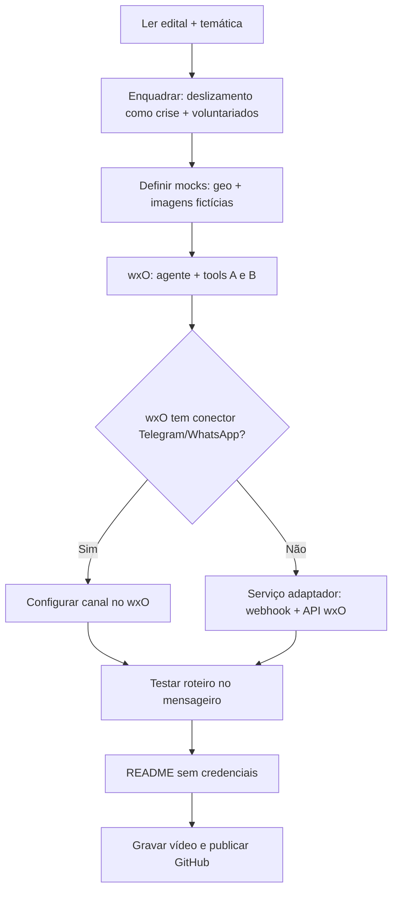
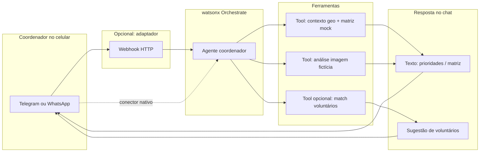

# Tarefas de implementação e fluxo do projeto

Baseado em `./docs` (Edital, Temática, materiais watsonx). **Imagens de entrada serão fictícias** para economizar tempo; dados geoespaciais também podem ser fictícios, desde que o fluxo seja coerente na demo.

---

## 1. O que os documentos tornam obrigatório ou central

| Fonte | Exigência prática |
|--------|-------------------|
| **Edital Hackathon 2026** | PoC de solução de **IA agentic** com **IBM watsonx Orchestrate** como plataforma de orquestração. IBM Cloud + conhecimento prévio de wxO (pré-work). **Entrega: 27/04 até 19h.** |
| **Temática do Hackathon 2026** | Tema: **“Orquestrando o Voluntariado Inteligente para Situações de Crise”**. A solução deve, em linha com a visão oficial: mapear habilidades/disponibilidade de voluntários, permitir que “instituições” descrevam necessidades, usar **IA para recomendar contribuições**, e **orquestrar fluxos pelo watsonx Orchestrate**. |
| **Guia watsonx (IBM)** | Conta IBM Cloud; cuidado com **créditos** no watsonx.ai; **não publicar credenciais** no GitHub; é possível rodar parte local e mostrar na submissão; alguns modelos estão fora de escopo no guia do *Experiential Lab* — usar modelos **permitidos na sua conta** (ex.: linha Granite quando disponível). |

**Conclusão para o MVP:** o núcleo entregável precisa ser **conversacional/orquestrado no wxO**, conectado ao **problema de voluntariado em crise**. O caso “barranco + matriz + imagem” vira **cenário de uso**: ex. defesa civil descreve deslizamento → sistema prioriza áreas/voluntários com skills certas → análise fictícia de imagem apoia decisão na demo.

**Canal com o usuário (sem front-end):** usar **Telegram** e/ou **WhatsApp** como única interface. Não há site nem app próprio; a demo é **mensagens + mídia** no mensageiro. Matriz e “mapa” viram **texto formatado** (tabela em monoespaçado, listas, ou arquivo `.txt`/JSON enviado como documento no Telegram, se couber no escopo da demo).

---

## 2. Backlog de tarefas (ordem sugerida)

### Fase 0 — Enquadramento (rápido, bloqueante conceitual)

- [ ] **T0.1** Documentar em 1 página (README ou `docs/visao.md`) como o caso “deslizamento de barranco” se encaixa na temática: **necessidade institucional** (coordenação de busca/mapeamento) + **voluntários** (habilidades: operador de drone, logística, GIS, apoio psicológico, etc.) + **orquestração wxO**.
- [ ] **T0.2** Definir **personas da demo**: 1 mensagem da “instituição” + 1 conjunto de voluntários fictícios com skills.

### Fase 1 — watsonx Orchestrate (obrigatório)

- [ ] **T1.1** Criar no wxO o **assistente/agente principal** (ex.: “Coordenador de crise – deslizamento”) com instruções claras: tom de apoio, linguagem sobre incerteza, sem afirmações legais/clínicas absolutas.
- [ ] **T1.2** Registrar **ferramentas (tools)** mínimas que o agente possa chamar:
  - **Tool A — Contexto geoespacial fictício:** entrada simplificada (ID do evento ou JSON fixo); saída: lista de trechos de barranco + imóveis próximos + scores para **matriz** (dados mock em código ou API estática).
  - **Tool B — “Análise” de imagem fictícia:** entrada: nome/caminho de cenário demo; saída: texto estruturado (zonas sugeridas, percentuais fictícios) **sem** afirmar que é imagem real ou resultado operacional real.
- [ ] **T1.3** (Opcional mas forte) **Agente colaborador** ou fluxo multi-etapas: um agente focado em “match de voluntários” chamando uma tool que retorna a tabela skill × necessidade.
- [ ] **T1.4** Testar no chat do wxO **roteiros de conversa** que cubram: (1) descrever desastre, (2) pedir matriz/risco, (3) enviar referência à imagem fictícia, (4) pedir sugestão de equipes voluntárias.

### Fase 2 — Dados e “motor” mock (rápido)

- [ ] **T2.1** Arquivos fictícios versionados: `dados/barrancos.geojson`, `dados/imoveis.csv` (ou um único JSON com tudo).
- [ ] **T2.2** **2–3 imagens fictícias** em `dados/imagens_demo/` + `README` explicando que são apenas para demonstração.
- [ ] **T2.3** Implementação das tools: preferencialmente **OpenAPI / função HTTP** apontando para um **servidor mínimo** (ex.: Node ou Python) que lê os mocks — ou conforme o wxO permitir na conta de vocês (script, conector, etc.).

### Fase 3 — Mensageiro como interface (sem front-end)

**Preferência:** **Telegram** primeiro — [Bot API](https://core.telegram.org/bots/api) gratuita, token simples, boa para foto/arquivo na demo. **WhatsApp** exige [Cloud API da Meta](https://developers.facebook.com/docs/whatsapp/cloud-api) ou provedor (ex.: Twilio); conta e aprovações costumam ser mais lentas — use só se o grupo já tiver ambiente pronto.

- [ ] **T3.1** Verificar no **catálogo do watsonx Orchestrate** se existe **conector nativo** (Telegram, WhatsApp, webhook genérico). Se existir e a conta permitir, configurar o canal oficialmente (menos código).
- [ ] **T3.2** Se não houver conector pronto: implementar **serviço adaptador** (Node/Python) com **webhook** que: (1) recebe atualizações do Telegram (ou do WhatsApp); (2) encaminha o texto (e metadados de mídia) para o **fluxo do agente no wxO** conforme a API/documentação disponível na conta; (3) devolve a resposta ao mensageiro. O wxO continua sendo o **cérebro** (instruções + tools); o adaptador é só **transporte**.
- [ ] **T3.3** Comandos mínimos na demo: ex. `/evento deslizamento-demo`, texto livre descrevendo a cena, pedido de “matriz”, envio de **foto fictícia** (Telegram manda `file_id` — o adaptador pode mapear para o cenário `demo1` na Tool B sem visão real).
- [ ] **T3.4** **Fallback para o vídeo:** se a integração mensageiro ↔ wxO não estiver estável a tempo, gravar o roteiro com **wxO no navegador** + explicar no README que o Telegram é o canal-alvo com o mesmo agente (julgadores costumam aceitar PoC com README honesto).

### Fase 4 — Qualidade de entrega

- [ ] **T4.1** README: problema, alinhamento ao tema do hackathon, como rodar o mock server e o **bot** (variáveis `TELEGRAM_BOT_TOKEN`, URL do webhook, etc.), como acessar o agente wxO, **sem segredos** (`.env.example`).
- [ ] **T4.2** Checklist pré-gravação: fluxo feliz no Telegram (ou WhatsApp), fallback se API IBM estiver lenta (resposta mock em tool).
- [ ] **T4.3** Vídeo: tema oficial + conversa no **mensageiro** mostrando matriz em texto e uso de imagem fictícia + (opcional) tela do wxO mostrando o mesmo agente/tools.

---

## 3. Fluxograma — como seguir

Fluxo **macro** (do problema à entrega):

Fluxo **do usuário na solução** (cenário demo):

---

## 4. Dependências entre tarefas (resumo)

1. **T0** antes de codar demais — evita solução “só GIS” sem encaixe no julgamento do tema e do wxO.
2. **T2** em paralelo com **T1.1**, mas **T1.2** precisa do contrato de dados de **T2.1–T2.2**.
3. **T3** depende de **T1** testado (idealmente primeiro no chat wxO, depois no mensageiro).
4. **T4** por último, mas **T4.2** pode nascer junto com os testes de **T1.4**.

---

## 5. Riscos específicos dos docs e do canal

- **Créditos watsonx.ai:** se usarem inferência pesada, preferir prompts curtos, modelos econômicos permitidos, e cache de respostas nas tools mock.
- **Avaliação:** solução que **não** use wxO como orquestrador central tende a ficar fora do pedido do edital; solução que **ignore** o eixo “voluntariado em crise” tende a ficar fraca frente à temática explícita.
- **WhatsApp:** atraso em número de teste, políticas da Meta ou custo de provedor — mitigar com **Telegram** como principal.
- **Webhook em desenvolvimento:** o Telegram exige HTTPS público para webhook (túnel tipo ngrok/localtunnel em demo local, ou deploy gratuito leve); documentar no README.

Este arquivo pode ser atualizado quando o desafio detalhado do dia **22/04** trouxer critérios extras de julgamento.
